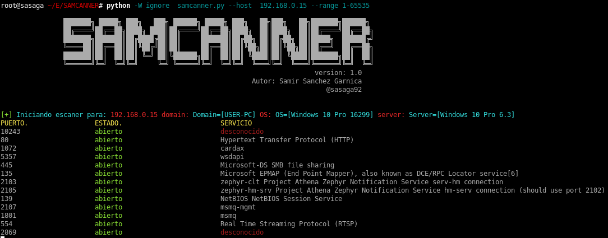
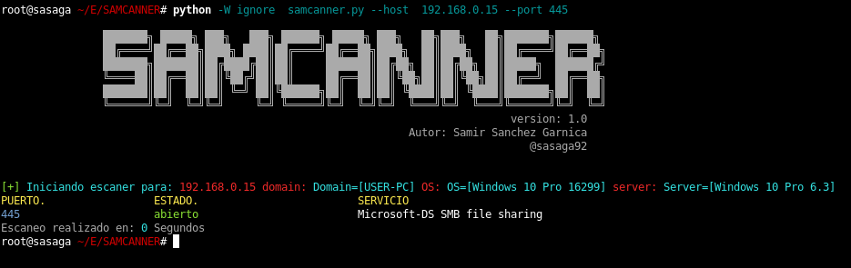

# SAMCANNER

SAMCANNER es un escaner de puertos TCP facil de utilizar basado en conexion por socket, programado en multihilos y multiprocessing para agilizar un poco la velocidad de estado de los puertos.


Ejemplo de uso con rango de puertos
```
python samcanner.py --host ip --range 1-65635 
```


Ejemplo de uso con puertos especificos, se debe separar por comas ',' para colocar el listado de puertos
```
python samcanner.py --host ip --port 22,80,135,137,445,8080 
```




Puedes colaborar a que siga creando nuevas herramientas con una donación en [Paypal](https://www.paypal.com) al correo ssanchezga@ufpso.edu.co
by [@sasaga92](https://twitter.com/sasaga92)


:heart_eyes: happy hacking!!!
